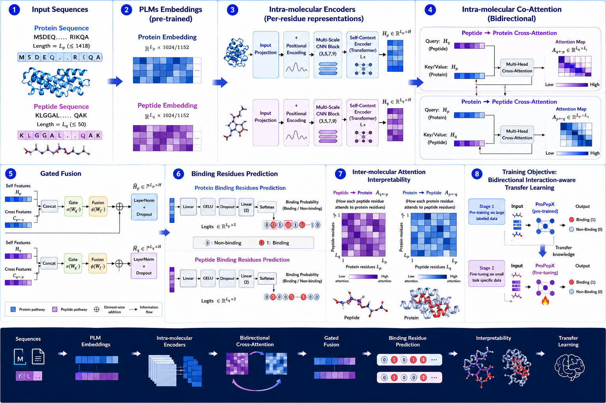

# ProPepX

<p align="center">
  <a href="https://syedkumailhussainnaqvi.github.io/ProPepX/">
    
  </a>
</p>

<p align="center">
  <b>A unified, interpretable, bidirectional interaction-aware transfer-learning framework for residue-level protein–peptide binding-site prediction</b>
</p>

<p align="center">
  <a href="https://github.com/SyedKumailHussainNaqvi/ProPepX"><b>GitHub</b></a> ·
  <a href="https://huggingface.co/syedkumailhussain/ProPepX/tree/main"><b>Hugging Face</b></a> ·
  <a href="https://syedkumailhussainnaqvi.github.io/ProPepX/"><b>Web page</b></a> ·
  <a href="docs/installation.md"><b>Installation</b></a> ·
  <a href="docs/inference.md"><b>Inference</b></a> ·
  <a href="docs/reproducibility.md"><b>Reproducibility</b></a>
</p>

<p align="center">
  <a href="https://www.python.org/"></a>
  <a href="https://pytorch.org/"></a>
  
  <a href="https://huggingface.co/syedkumailhussain/ProPepX/tree/main"></a>
  
  
</p>

---

## Overview

**ProPepX** predicts binding residues in protein–peptide interactions from protein and peptide sequences. It combines protein-language-model embeddings with intra-molecular encoders, bidirectional protein↔peptide co-attention, gated fusion, and residue-level output heads. Unlike sequence-only predictors that process binding partners independently, ProPepX evaluates protein and peptide representations in a shared interaction-aware context.

The repository provides command-line inference, a browser-based interface, pretrained and fine-tuned checkpoints, test embeddings, training scripts, and reproducibility instructions for manuscript review.

---

## Why ProPepX?

| Limitation in many existing tools | ProPepX design |
|---|---|
| Protein and peptide are encoded independently | Bidirectional protein↔peptide co-attention |
| Single-partner prediction | Protein-side, peptide-side, joint, and zero-shot modes |
| Limited interpretability | Residue probabilities, interaction maps, and HTML reports |
| Hard-to-reproduce pipelines | Conda environment, documented checkpoints, and scripted inference |
| No easy interface for non-programmers | Integrated web server and static GitHub Pages demo |

---

## At a glance

| Item | Details |
|---|---|
| Framework | PyTorch |
| Main language | Python |
| Recommended Python | 3.11 |
| GPU support | CUDA-enabled NVIDIA GPUs |
| Embedding backbones | ProtTransT5 and ESM-3 600M |
| Prediction modes | Protein-side, peptide-side, joint, zero-shot |
| Input | Raw sequence or FASTA-like protein/peptide sequence |
| Output | HTML report, CSV residue scores, figures, and metadata |
| Web interface | FastAPI/HTML and static demo page |
| Model hub | [Hugging Face ProPepX](https://huggingface.co/syedkumailhussain/ProPepX/tree/main) |
| Repository | [GitHub ProPepX](https://github.com/SyedKumailHussainNaqvi/ProPepX) |

---

## Key capabilities

| Capability | Supported |
|---|:---:|
| Protein binding-residue prediction | Yes |
| Peptide binding-residue prediction | Yes |
| Joint protein–peptide prediction | Yes |
| Zero-shot prediction | Yes |
| ProtTransT5 embeddings | Yes |
| ESM-3 600M embeddings | Yes |
| HTML prediction report | Yes |
| Residue-level score export | Yes |
| Interaction/attention-style visualization | Yes |
| Web server | Yes |
| Docker-ready deployment | Yes |
| Training and fine-tuning scripts | Yes |

---

## Workflow

```text
Protein sequence + Peptide sequence
              │
              ▼
Protein language model embeddings
ProtTransT5 or ESM-3
              │
              ▼
Intra-molecular encoders
              │
              ▼
Bidirectional protein↔peptide co-attention
              │
              ▼
Gated interaction-aware fusion
              │
              ▼
Residue-level binding prediction
              │
              ▼
CSV scores + heatmaps + interactive HTML report
```

---

## Repository layout

```text
ProPepX/
├── ProPepX/                         # Core model and prediction code
├── app/                             # Optional FastAPI web-server backend
├── Examples/                        # Example input sequences and demos
├── ProPepX Model Weight & Test Dataset Features/
├── ProPepX_Test_Datasets_results/
├── docs/                            # Extended documentation
├── ProPepX.png                      # Main architecture/workflow figure
├── propepx.yml                      # Conda environment
├── propepx_predict.py               # Command-line inference
├── pretrain_propepx.py              # Pretraining script
├── finetune_propepx.py              # Fine-tuning script
├── index.html                       # Static web/demo page
└── README.md
```

---

## Installation

Create the environment:

```bash
git clone https://github.com/SyedKumailHussainNaqvi/ProPepX.git
cd ProPepX

conda env create -f propepx.yml
conda activate propepx
```

For detailed installation, troubleshooting, and hardware notes, see [`docs/installation.md`](docs/installation.md).

---

## Quick start

Run a single joint protein–peptide prediction:

```bash
mkdir -p results

python propepx_predict.py \
  --protein "MEMPQLSKWNQDSRNDAMENTLLVSHVLPNISVAQIHNALDGISFVQHFSLSTINLIKNDERSLWVHFKAGTNMDGAKEAVDGIQLDSNFTIESENPKIPTHTHPIPIFEIASSEQTCKNLLEKLIRFIDRASTKYSLPNDAAQRIEDRLKTHASMKDDDDKPTNFHDIRLSDLYAEYLRQVATFDFWTSKEYESLIALLQDSPAGYSRKKFNPSKEVGQEENIWLSDLENNFACLLEPENVDIKAKGALPVEDFINNELDSVIMKEDEQKYRCHVGTCAKLFLGPEFVRKHINKKHKDWLDHIKKVAICLYGYVLDPCRAMDPKVVSSAWSHPQFEK" \
  --peptide "KNEEDESNDSDKEDGEISEDD" \
  --embedding prottrans \
  --mode mode-GLOBAL \
  --dataset leads_ts251 \
  --gpu_id 0 \
  --save_html "results/"
```

A typical single-pair prediction can complete in less than 100 seconds after packages, checkpoints, and embeddings are already available locally. Runtime depends on GPU, sequence length, embedding backend, and checkpoint loading.

More examples are available in [`docs/inference.md`](docs/inference.md).

---

## Prediction modes

| Mode | Argument | Description |
|---|---|---|
| Protein-side | `--mode prot` | Predicts peptide-binding residues on the protein |
| Peptide-side | `--mode pep` | Predicts protein-binding residues on the peptide |
| Joint | `--mode mode-GLOBAL` | Predicts binding residues for both partners |
| Zero-shot | `--mode zero-shot` | Runs transfer-learning prediction without task-specific fine-tuning |

---

## Input and output

| Input type | Supported format |
|---|---|
| Protein | Raw amino-acid sequence or FASTA-like sequence |
| Peptide | Raw amino-acid sequence or FASTA-like sequence |
| Amino acids | Standard amino-acid characters |
| Batch mode | Supported when prepared input files/embeddings are provided |

| Output file | Description |
|---|---|
| `prediction_report.html` | Interactive prediction summary |
| `protein_binding_scores.csv` | Protein residue-level probabilities and labels |
| `peptide_binding_scores.csv` | Peptide residue-level probabilities and labels |
| `residue_probability_map.png` | Residue-level probability visualization |
| `interaction_heatmap.png` | Interaction/attention-style map |
| `summary.json` | Run metadata and configuration |

---

## Web server

Run the static demo page:

```bash
python -m http.server 8000
```

Open:

```text
http://localhost:8000
```

Run the application server when the `app/` backend is available:

```bash
uvicorn app.main:app --host 0.0.0.0 --port 8000
```

Detailed web-server instructions are in [`docs/webserver.md`](docs/webserver.md).

---

## Docker

```bash
docker build -t propepx:latest .
docker run --gpus all -p 8000:8000 propepx:latest
```

For CPU-only testing:

```bash
docker run -p 8000:8000 propepx:latest
```

More deployment notes are in [`docs/docker.md`](docs/docker.md).

---

## Models and datasets

Pretrained/fine-tuned checkpoints and benchmark embeddings are hosted on Hugging Face:

<p>
  <a href="https://huggingface.co/syedkumailhussain/ProPepX/tree/main"><b>Open ProPepX on Hugging Face</b></a>
</p>

| Task | Backbone | Dataset/setting |
|---|---|---|
| Joint protein–peptide prediction | ESM-3 600M | LEADS TS251 |
| Joint protein–peptide prediction | ProtTransT5 | LEADS TS251 |
| Joint protein–peptide prediction | ESM-3 600M | Test167 |
| Joint protein–peptide prediction | ProtTransT5 | Test167 |
| Protein-side prediction | ESM-3 600M | TS092, TS125, TS251, TS639 |
| Protein-side prediction | ProtTransT5 | TS092, TS125, TS251, TS639 |
| Peptide-side prediction | ESM-3 600M | CAMP TS231 |
| Peptide-side prediction | ProtTransT5 | CAMP TS231 |
| Zero-shot prediction | ESM-3 600M | TS167 zero-shot |
| Zero-shot prediction | ProtTransT5 | TS167 zero-shot |

Detailed checkpoint links are in [`docs/models.md`](docs/models.md).

---

## Benchmark summary

Replace the placeholders below with the final manuscript values before submission.

| Dataset | Mode | Backbone | Precision | Recall | F1 | MCC | AUC |
|---|---|---|---:|---:|---:|---:|---:|
| TS092 | Protein-side | ESM-3 / ProtTransT5 | TBD | TBD | TBD | TBD | TBD |
| TS125 | Protein-side | ESM-3 / ProtTransT5 | TBD | TBD | TBD | TBD | TBD |
| TS251 | Protein-side / Joint | ESM-3 / ProtTransT5 | TBD | TBD | TBD | TBD | TBD |
| TS639 | Protein-side | ESM-3 / ProtTransT5 | TBD | TBD | TBD | TBD | TBD |
| CAMP TS231 | Peptide-side | ESM-3 / ProtTransT5 | TBD | TBD | TBD | TBD | TBD |
| Test167 | Joint / Zero-shot | ESM-3 / ProtTransT5 | TBD | TBD | TBD | TBD | TBD |

---

## Feature comparison

| Feature | Sequence-only predictors | Single-chain binding-site tools | ProPepX |
|---|:---:|:---:|:---:|
| Protein-side residue prediction | Partial | Yes | Yes |
| Peptide-side residue prediction | Partial | No | Yes |
| Joint protein–peptide prediction | No | No | Yes |
| Bidirectional interaction modeling | No | No | Yes |
| Protein language model embeddings | Partial | Partial | Yes |
| Zero-shot prediction | No | No | Yes |
| Residue-level interpretability maps | Limited | Limited | Yes |
| Web-server interface | Tool-dependent | Tool-dependent | Yes |
| Reproducible checkpoints and scripts | Tool-dependent | Tool-dependent | Yes |

---

## Reproducibility checklist

| Item | Status |
|---|:---:|
| Source code | Available |
| Conda environment | Available |
| Command-line inference | Available |
| Web-server interface | Available |
| Pretrained/fine-tuned checkpoints | Available on Hugging Face |
| Test embeddings | Available on Hugging Face |
| Training scripts | Available |
| Fine-tuning scripts | Available |
| Example commands | Available |
| Docker instructions | Available |
| Manuscript performance table | To be updated after final acceptance |

Training and fine-tuning commands are provided in [`docs/training.md`](docs/training.md). Full reproduction notes are in [`docs/reproducibility.md`](docs/reproducibility.md).

---

## Documentation

| Document | Purpose |
|---|---|
| [`docs/installation.md`](docs/installation.md) | Environment setup, hardware, and troubleshooting |
| [`docs/inference.md`](docs/inference.md) | CLI prediction examples for all modes |
| [`docs/models.md`](docs/models.md) | Hugging Face checkpoint and dataset organization |
| [`docs/webserver.md`](docs/webserver.md) | Static demo and FastAPI server usage |
| [`docs/docker.md`](docs/docker.md) | Docker build and deployment |
| [`docs/training.md`](docs/training.md) | Pretraining and fine-tuning commands |
| [`docs/reproducibility.md`](docs/reproducibility.md) | Review checklist and validation notes |
| [`docs/faq.md`](docs/faq.md) | Common installation and inference questions |

---

## Citation

If you use ProPepX, please cite:

```bibtex
@article{propepx2026,
  title   = {ProPepX: interaction-aware transfer learning for protein-peptide binding residue prediction},
  author  = {Hussain, Syed Kumail and Chandra, Sourav and collaborators},
  journal = {Nature Machine Intelligence},
  year    = {2026},
  note    = {Manuscript under review}
}
```

---

## Contact

For questions, issues, and collaboration:

**Syed Kumail Hussain Naqvi**  
Department of Physical-AI Convergence Engineering  
Jeonbuk National University, Republic of Korea  

Email: <a href="mailto:syedkumailhussainnaqvi@jbnu.ac.kr">syedkumailhussainnaqvi@jbnu.ac.kr</a>  
GitHub: <a href="https://github.com/SyedKumailHussainNaqvi/ProPepX">https://github.com/SyedKumailHussainNaqvi/ProPepX</a>  
Hugging Face: <a href="https://huggingface.co/syedkumailhussain/ProPepX/tree/main">https://huggingface.co/syedkumailhussain/ProPepX/tree/main</a>  

Please open a **GitHub Issue** for reproducibility questions, installation problems, bug reports, or requests for additional examples.

---

## License

This software is copyrighted by [Bioinformatics Lab](https://nsclbio.jbnu.ac.kr/) @ Jeonbuk National University. Please update this section with the final license selected for public release.
